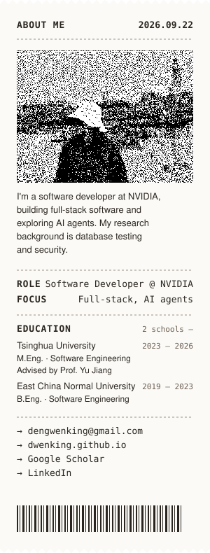

<table>
<tr>
<td width="300" valign="top">

[Email](mailto:dengwenking@gmail.com) · [Site](https://dwenking.github.io/) · [Scholar](https://scholar.google.com/citations?user=Sc1-8ygAAAAJ) · [LinkedIn](https://www.linkedin.com/in/wenqian-deng-39a74b206/)

</td>
<td valign="top">

### Career card
*A few stops along the way*

| | | |
|---|---|---|
| **2026 –** | **NVIDIA** · Software Developer | `Java` `Spring Boot` `Vue` `MongoDB` `Redis` |
| 2026 | **ByteDance** · SDE Intern | `Go` `Kitex` `SFT` |
| 2025 | **Amazon** · SDE Intern | `AWS` `Lambda` `SQS` `DynamoDB` `Agent SDK` `MCP` `OpenTelemetry` |
| 2025 | **Alibaba Cloud** · Research Intern | `Python` `LLM workflow` |
| 2021, 2022 | **Microsoft** · SDE Intern | `C#` `SQL` `Azure Logic Apps` |

### 01 EXPERIENCE

<b>NVIDIA / 2026 –</b> — Full-stack development on an internal engineering planning platform.

<b>BYTEDANCE / 2026</b> — A batch LLM inference service, and fine-tuned moderation models launched to production.

- Built a stateless batch LLM inference service with scheduled jobs, object-storage I/O, and Redis-based distributed rate limiting.
- Fine-tuned Qwen 4B (LoRA SFT) and Qwen3-VL-8B content moderation classifiers; the small text model absorbed 85% of traffic at 93% recall.
- Moved the image-embedding model behind a vector-DB prefilter, tuning thresholds by F1 with a staged rollout.

<b>AMAZON / 2025</b> — A log-trace correlation feature for an observability platform, and an AI agent assistant built on AWS components.

- Built end-to-end log-trace correlation via a custom OpenTelemetry Java agent extension injecting trace context into Log4j.
- Designed a multi-agent ticket-triage assistant (Strands Agents, MCP) with hallucination checks; intent-classification F1 from 0.82 to 0.93.
- Integrated the agent with the ticketing system over SQS and Lambda with exponential backoff, DLQ, and a DynamoDB idempotency table.

<b>ALIBABA CLOUD / 2025</b> — A DBMS testing tool based on equivalent data construction, and an LLM workflow that migrates SQL test cases.

- Led the research behind "Detecting Logic Bugs in DBMSs via Equivalent Data Construction", accepted at SIGMOD 2026.
- Built an LLM workflow that converts SQL test cases between database dialects end to end.

<b>MICROSOFT / 2021, 2022</b> — An API usage analytics dashboard, and a small cache-consistency check tool.

- Aggregated and analysed API call data from tens of millions of users across dimensions for product performance monitoring.
- Scheduled daily multi-dimension reports with Azure Logic Apps, emailed to the team automatically.

### 02 SIDE PROJECTS

- **[commit-file-tree](https://open-vsx.org/extension/dwenking/commit-file-tree)** · VS Code / Cursor extension — Review AI-generated commits like a PR: unpushed work as file trees, line comments, risk flags, one-click feedback export for your agent.

### 03 PUBLICATIONS

| | | |
|---|---|---|
| `SIGMOD'26` | Detecting Logic Bugs in DBMSs via Equivalent Data Construction | [PDF](https://dwenking.github.io/attaches/edc.pdf) · [CODE](https://github.com/THU-WingTecher/EDC) |
| `SOSP'25` | Fawkes: Finding Data Durability Bugs in DBMSs via Recovered Data State Verification | [PDF](https://dwenking.github.io/attaches/fawkes.pdf) |
| `ATC'25` | DDLumos: Understanding and Detecting Atomic DDL Bugs in DBMSs | [PDF](https://dwenking.github.io/attaches/ddlumos.pdf) |
| `ICSE'25` | Coni: Detecting Database Connector Bugs via State-Aware Test Case Generation | [PDF](https://dwenking.github.io/attaches/coni.pdf) · [CODE](https://github.com/THU-WingTecher/Coni) |

</td>
</tr>
</table>

© 2026 WENQIAN DENG · UPDATED: SEP 22, 2026 · Receipt is a hand-written SVG in <code>img/receipt.svg</code>; the portrait is the same 1-bit dither as <a href="https://dwenking.github.io/">dwenking.github.io</a>.
